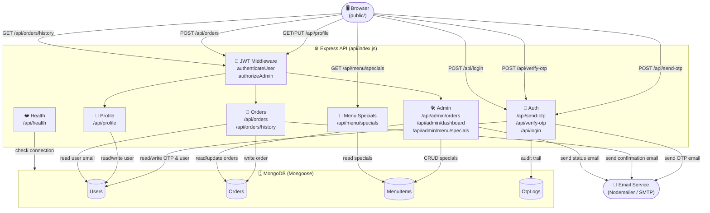
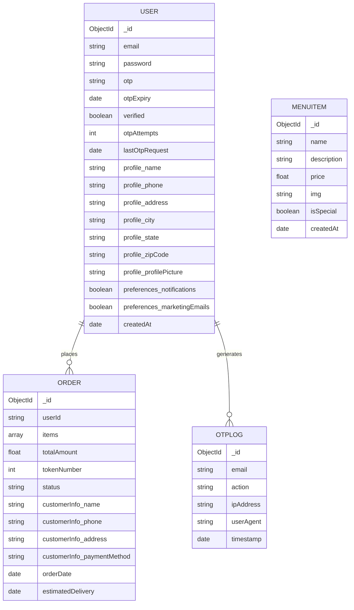

# 🍽️ Book-Bite

> **Canteen food pre-booking made simple.** Students register, browse the menu, place orders in advance, and receive a token number — no more queues.


---

## 📑 Table of Contents

1. [Features](#-features)
2. [Tech Stack](#-tech-stack)
3. [Project Structure](#-project-structure)
4. [Architecture — Data Flow Diagram (DFD)](#-architecture--data-flow-diagram-dfd)
5. [Database — ER Diagram](#-database--er-diagram)
6. [API Reference](#-api-reference)
7. [Prerequisites](#-prerequisites)
8. [Environment Variables](#-environment-variables)
9. [Installation & Running Locally](#-installation--running-locally)
10. [Deployment](#-deployment)

---

## ✨ Features

| Feature | Description |
|---------|-------------|
| 🔐 OTP Signup | Email-based OTP flow with rate limiting and attempt tracking |
| 🔑 JWT Auth | Stateless authentication with role-based access (user / admin) |
| 🛒 Order Booking | Place food orders with a generated 4-digit token number |
| 📬 Email Notifications | Order confirmation and status update emails via Nodemailer |
| 👤 Profile Management | Users can view and update their personal details |
| 📋 Order History | Users can view all past orders |
| 🛠️ Admin Dashboard | Real-time summary: total orders, revenue, pending counts |
| 🍴 Menu Specials | Admins can add, update, and delete daily specials |

---

## 🛠️ Tech Stack

| Layer | Technology |
|-------|-----------|
| Runtime | Node.js 24.x |
| Framework | Express 4.x |
| Database | MongoDB + Mongoose |
| Auth | JSON Web Tokens (jsonwebtoken), bcryptjs |
| Email | Nodemailer (SMTP / Gmail) |
| Logging | Winston |
| Rate Limiting | express-rate-limit |
| Deployment | Vercel (serverless) |

---

## 📁 Project Structure

```text
Book-Bite/
├── api/
│   └── index.js          ← Express app + all API routes
├── public/
│   ├── index.html         ← Login page
│   ├── signup.html        ← Registration page
│   ├── menu.html          ← Food menu & cart
│   ├── cart.html          ← Cart / checkout
│   ├── profile.html       ← User profile
│   ├── admin.html         ← Admin dashboard
│   ├── style.css
│   ├── menuStyle.css
│   ├── cartStyle.css
│   ├── profile.css
│   ├── admin.css
│   └── *.jpg / *.gif      ← Static food images
├── .env.example           ← Environment variable template
├── package.json
└── vercel.json            ← Vercel rewrite rules
```

---

## 🗺️ Architecture — Data Flow Diagram (DFD)

The diagram below shows how data flows between the browser, Express API, MongoDB, and the email service.



---

## 🗃️ Database — ER Diagram

Four MongoDB collections and their relationships:



---

## 📡 API Reference

### Auth

| Method | Endpoint | Auth | Description |
|--------|----------|------|-------------|
| `POST` | `/api/send-otp` | ❌ | Send OTP to email (rate-limited: 5/15 min) |
| `POST` | `/api/verify-otp` | ❌ | Verify OTP & create account |
| `POST` | `/api/login` | ❌ | Login; returns JWT (rate-limited: 10/15 min) |
| `GET`  | `/api/health` | ❌ | API + DB health check |

### User (requires JWT)

| Method | Endpoint | Description |
|--------|----------|-------------|
| `GET`  | `/api/profile` | Get current user profile |
| `PUT`  | `/api/profile` | Update profile & preferences |
| `POST` | `/api/orders` | Place a new food order |
| `GET`  | `/api/orders/history` | Get personal order history |
| `GET`  | `/api/menu/specials` | List today's specials (public) |

### Admin (requires JWT + admin role)

| Method | Endpoint | Description |
|--------|----------|-------------|
| `GET`  | `/api/admin/orders` | List all orders (filterable by status/date) |
| `GET`  | `/api/admin/dashboard` | Summary: total orders, revenue, pending count |
| `PUT`  | `/api/admin/orders/:orderId` | Update order status |
| `POST` | `/api/admin/menu/specials` | Add a new special menu item |
| `GET`  | `/api/menu/specials` | List specials |
| `PUT`  | `/api/admin/menu/specials/:id` | Update a special |
| `DELETE` | `/api/admin/menu/specials/:id` | Delete a special |

> **Order status values:** `Pending` → `Processing` → `Completed` / `Cancelled`

---

## 🔧 Prerequisites

- **Node.js** `24.x`
- **npm**
- **MongoDB** — local instance or [MongoDB Atlas](https://www.mongodb.com/atlas)
- An SMTP email account (Gmail recommended) for OTP delivery

---

## 🌍 Environment Variables

Copy `.env.example` to `.env` and fill in your values:

```env
# MongoDB Connection String
# Local:  mongodb://127.0.0.1:27017/bookAndBite
# Atlas:  mongodb+srv://<user>:<pass>@cluster.mongodb.net/bookAndBite
MONGODB_URI=

# JWT signing secret (use a long random string in production)
JWT_SECRET=

# SMTP / Email configuration
EMAIL=
EMAIL_PASSWORD=
SMTP_HOST=smtp.gmail.com
SMTP_PORT=587

# Admin login credentials
ADMIN_EMAIL=
ADMIN_PASSWORD=

# Environment flag
NODE_ENV=development
```

> **Tip:** Set `EMAIL_DISABLED=true` to skip all email sending during local development.

---

## 🚀 Installation & Running Locally

```bash
# 1. Install dependencies
npm install

# 2. Copy and configure environment variables
cp .env.example .env
# Edit .env with your MongoDB URI, JWT secret, and email credentials

# 3. Start the development server
npm run dev
```

The server serves both the API (`/api/*`) and the static frontend (`public/`) when running locally.

### Available Scripts

| Script | Command | Description |
|--------|---------|-------------|
| Start | `npm start` | Run server in production mode |
| Dev | `npm run dev` | Run server in development mode |

---

## ☁️ Deployment

This project is configured for **Vercel** serverless deployment.

```json
// vercel.json
{
  "rewrites": [
    { "source": "/api/(.*)", "destination": "/api/index.js" }
  ]
}
```

All `/api/*` requests are routed to `api/index.js`; static files in `public/` are served automatically by Vercel's CDN.

**Steps:**
1. Push this repository to GitHub.
2. Import the project in [Vercel](https://vercel.com).
3. Add all environment variables from `.env.example` in the Vercel project settings.
4. Deploy — Vercel handles the rest.
